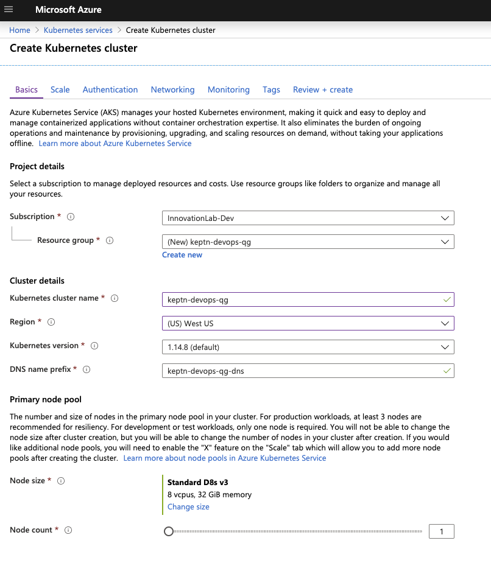

# Azure DevOps Pipelines with Keptn Quality Gates

In this tutorial I'm going to describe a way how to integrate Keptn Quality Gates in your Azure DevOps pipelines. As there might be multiple ways how to do this, I will show you one that works easy and straight-forward to help you get started. I am happy to see what you are building with Azure Devops and Keptn - ping me on [@jetzlstorfer](https://twitter.com/jetzlstorfer) and let me know!

**The tutorial will cover**

1. Install Keptn for quality gates only use case on AKS
1. Create a project and service
1. Define Service Level Indicators (SLIs) to fetch metrics from Dynatrace
1. Define Service Level Objectives (SLOs) for quality gates
1. Set up pipeline in Azure DevOps
1. Deploy app with Azure DevOps pipeline
1. See Keptn quality gates in action

## Prequisite

-  Have a Kubernetes cluster running to install Keptn on. If not, you can create a new cluster in AKS. In my case, I am naming the resource group and cluster `keptn-devops-qg` and use one D8sv3 node for Keptn to run on.
    


## Install Keptn

Once we have the cluser for Keptn, we are going to install Keptn on it.
Open your favourite terminal and execute the following steps.

1. Get the Keptn CLI from Keptn.sh
    ```console
    curl -sL https://get.keptn.sh | sudo -E bash
    ```
    This will download the Keptn CLI for your operating system and put it into `usr/local/bin/keptn`.

1. Test if the Keptn CLI is available by typing
    ```console
    keptn version
    ```
    Which should give you
    ```
    CLI version: 0.6.0
    ```

1. Now install Keptn on the AKS cluster
    ```console
    keptn install --platform=aks --use-case=quality-gates
    ```
    This command should run for a bout 5 minutes and install everything that is needed from Keptn into the AKS cluster. 

1. Check if the installation was successful and also retrieve the public IP of your Keptn installation:
    ```console
    keptn status
    ```
    Output (similar to this):
    ```console
    Starting to authenticate
    Successfully authenticated
    CLI is authenticated against the Keptn cluster https://api.keptn.XXXXXXXXX.xip.io
    ```

1. We want to make sure to use the latest version of the Keptn's Bridge that is currently available in an EAP. We can update by executing this commands:
    ```console
    kubectl -n keptn set image deployment/bridge bridge=keptn/bridge2:0.6.1.EAP.20200221.1458 --record
    kubectl -n keptn-datastore set image deployment/mongodb-datastore mongodb-datastore=keptn/mongodb-datastore:0.6.1.EAP.20200131.1010 --record
    ```

1. In the current version of Keptn (0.6.0), the bridge is by default not exposed to the public. For this tutorial, however, we want to have easy access to the bridge and therefore expose it via its own subdomain. There is a script prepared to execute:
    ```console
    cd scripts/expose-bridge
    ./exposeBridge.sh
    cd ..
    ```
    You will get the public IP of your bridge:
    ```
    ingress.extensions/bridge-ingress created
    Bridge URL: https://bridge.keptn.XXXXXXXX.xip.io
    ```

1. You can now access the your Keptn Bridge (it will be empty right now though):
    

Now Keptn is installed, the bridge is upgraded and exposed and we are ready to use Keptn!

## Create Project

Most of the things in Keptn start by defining a project which will hold one or more services. Therefore, please go ahead and create a project called `sockshop`. The definition of the project is held in the `shipyard.yaml` file and is quite simple in our case:

```yaml
stages:
  - name: "preprod"
```

We can also link the project we are creating to a external git repository to have full visibility of all configuration files that are managed by Keptn. In my case I am using my personal Github account and personal access token to do access a repo I created for this tutorial. Please note that the repository has to already exist.

1. Switch into the right directory:
    ```console
    cd keptn-files
    ```

1. Create project with Keptn CLI.

    1. Option 1: Link it to a Github repository.
        ```console
        keptn create project sockshop --shipyard=./shipyard --git-user=jetzlstorfer --git-remote-url=https://github.com/keptn-azure/sockshop.git --git-token=XXXXX
        ```
    1. Option 2: Do not link it to a Github repository
        ```console
        keptn create project sockshop --shipyard=./shipyard
        ```

1. Now we are going to create the shopping cart service within the project. We will need this service as we will later build our quality gates for it. Please note that Keptn will not be responsible for deploying this service. (For Keptn insider: we would use the command `keptn onboard service` instead.)
    ```console
    keptn create service carts --project=sockshop
    ```

## Define Service Level Indicators

Keptn uses monitoring data as Service-Level Indicators (SLIs) upon which we can define our quality gates. But first, we are going to define which SLIs we are going to use for our project. Keptn has already a built-in library of SLIs, however, we are going to use our custom SLIs for this tutorial, therefore we add them to our service in Keptn.
The file `dynatrace-slis.yaml` holds the following content, which are the API calls to Dynatrace to gather the data that is needed for evaluation for the quality gates. Please note that this file can be extended or changed, therefore making other SLIs available to your quality gates.

```yaml
---
spec_version: '1.0'
indicators:
  throughput: "builtin:service.requestCount.total:merge(0):count?scope=tag(project:$PROJECT),tag(service:$SERVICE)"
  error_rate: "builtin:service.errors.total.count:merge(0):avg?scope=tag(project:$PROJECT),tag(service:$SERVICE)"
  response_time_p50: "builtin:service.response.time:merge(0):percentile(50)?scope=tag(project:$PROJECT),tag(service:$SERVICE)"
  response_time_p90: "builtin:service.response.time:merge(0):percentile(90)?scope=tag(project:$PROJECT),tag(service:$SERVICE)"
  response_time_p95: "builtin:service.response.time:merge(0):percentile(95)?scope=tag(project:$PROJECT),tag(service:$SERVICE)"
```

1. We are going to add the file via the Keptn CLI to our **carts** service in the **preprod** environment of our **sockshop** project.
    ```console
    keptn add-resource --project=sockshop --stage=preprod --service=carts --resource=./dynatrace-slis.yaml --resourceUri=dynatrace/sli.yaml
    ```

1. Now the file has been added, we have to provide access to the Dynatrace tenant that will hold the data to Keptn. Therefore, please provide credentials for the Dynatrace SLI service to be able to fetch the metrics from Dynatrace.
    1. Define the credentials:
        ```console
        cd ../scripts

        ./defineDynatraceCredentials.sh
        ```
    1. Install the Dynatrace SLI service
        ```console
        ./installDynatraceSLIService.sh
        ```

1. Now the SLI service is installed, we will enable it for the **sockshop** project. This step is necessary, since different projects can have their own SLI provider.

    ```console
    ./enableDynatraceSLIforProject.sh sockshop
    ```

## Define Service Level Objectives

Now that we have defined our SLIs and how to retrieve them, we can build our Service-Level Objectives (SLOs) on top of that. In the `slo.yaml` we are going to use, we have defined an objective for the response time for the 95 percentile, named `response_time_p95`. 

```yaml
---
spec_version: '0.1.1'
comparison:
  compare_with: "single_result"
  include_result_with_score: "pass"
  aggregate_function: avg
objectives:
  - sli: response_time_p95
    pass:             # pass if (relative change <= 10% AND absolute value is < 600ms)
      - criteria:
          - "<=+10%"  
          - "<600"    
    warning:          # if the response time is below 800ms, the result should be a warning
      - criteria:
          - "<=800"
  - sli: throughput   # sli without criteria are used for information only purposes
  - sli: error_rate
  - sli: response_time_p50
  - sli: response_time_p90
total_score:          # scoring based on all objectives
  pass: "90%"
  warning: "75%"
```

1.  We are going to add the file via the Keptn CLI to our **carts** service in the **preprod** environment of our **sockshop** project:
    ```console
    cd ../keptn-files

    keptn add-resource --project=sockshop --service=carts --stage=preprod --resource=./keptn-files/slo.yaml --resourceUri=slo.yaml
    ```

1. **Optional**: we can verify all our configuration in our Github repository (if we have linked it previously):
    We can see the added `slo.yaml` as well as the `dynatrace` folder that holds the added `sli.yaml` file.

    

## Set up Azure DevOps pipeline


